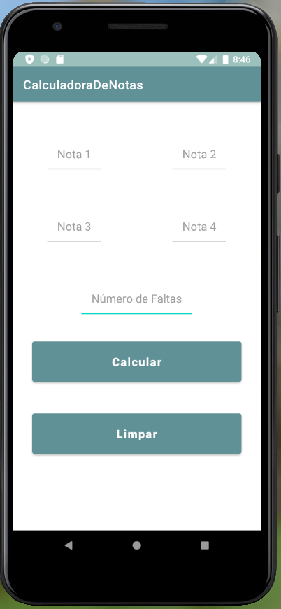

# CalculadoraDeNotas
Calculadora de notas que leva em consideração o número de faltas do aluno.

## Ferramentas utilizadas:

Android Studio 4.1.2
Build #AI-201.8743.12.41.7042882, built on December 19, 2020
VM: OpenJDK 64-Bit Server VM by JetBrains s.r.o
Windows 10 10.0

## Linguagens:

Kotlin 1.4.31
minSdkVersion 23

## Imagem da Aplicação
